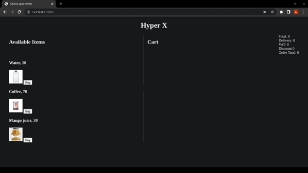

# ITI_Jquery lab, Restaurant Menu

An interactive menu, 2 panels menu and cart, menu items can be bought by clicking 'buy' or dragging the item to the cart, cart items can be increased or removed by button or drag

## Table of contents

- [My process](#process)
    - [Built with](#built-with)
    - [Libraries](#Libraries)
- [Author](#authors)

##GIF



## process
1) Clone the project

   ``` git clone https://github.com/AmSaleh21/ITI_Jquery.git ```

2) make sure you have php client and run from the project directory
    
    ``` php -S 127.0.0.1:8000 ```

3) open the address ```127.0.0.1:8000 ``` in your favourte browser

<p align="right">(<a href="#top">back to top</a>)</p>

### Built with

* [PHP Native](https://www.php.net/)
* [JavaScript](https://www.javascript.com/)
* [Jquery](https://jquery.com/)
* [Jquiry ui](https://jqueryui.com/)

<p align="right">(<a href="#top">back to top</a>)</p>

## Authors

* Abdelrahman Saleh   - [Github](https://github.com/AmSaleh21) - [Linkedin](https://www.linkedin.com/in/amsaleh21/)

<p align="right">(<a href="#top">back to top</a>)</p>
